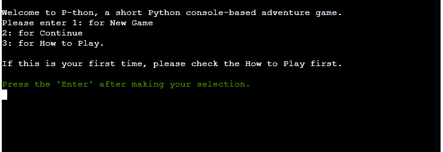
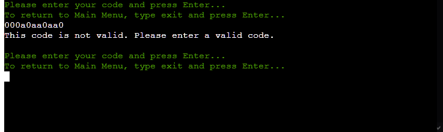
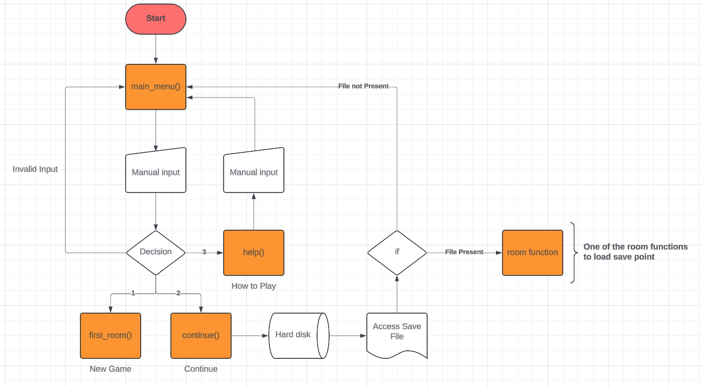
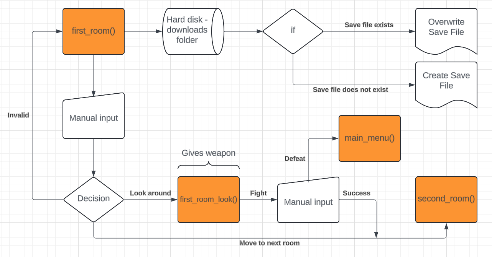
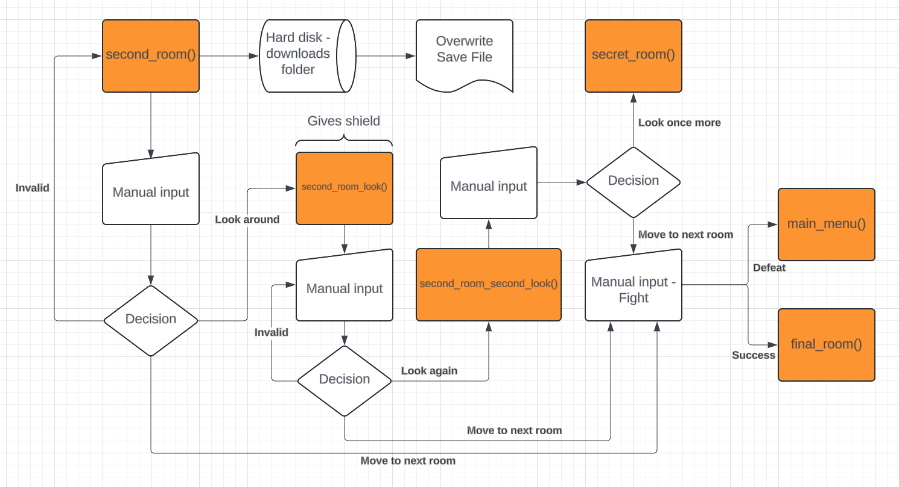
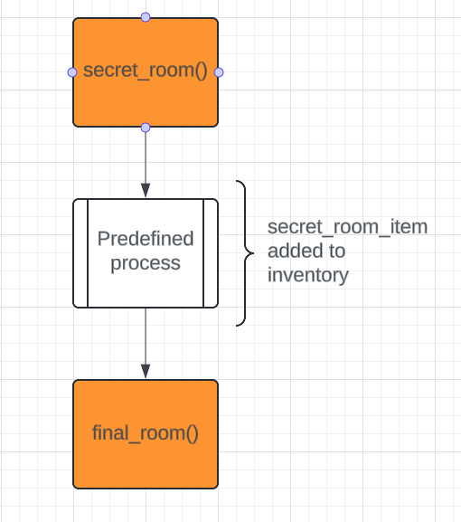
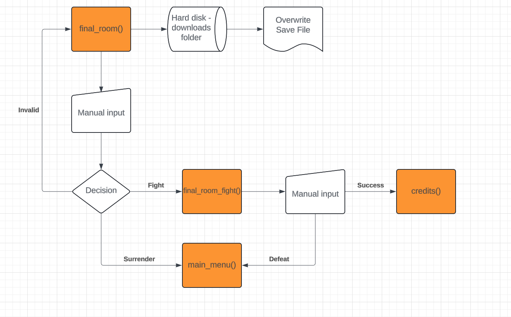

## Table Of Contents

* [Introduction](#Introduction)
    * [Site Goals](#Site-Goals)
    * [Target Audience](#Target-Audience)
    * [Features Planned](#Features-Planned)
* [Structure](#Structure)
    * [Features](#Features)
    * [Features left to Implement](#Features-Left-to-Implement)
* [Logical Flow](#Logical-Flow)
* [Technologies](#Technologies)
* [Testing](#Testing)
    * [Functional Testing](#Functional-Testing)
    * [PEP 8 Checker](#PEP-8-Checker)
    * [Bugs and Fixes](#Bugs-and-Fixes)
* [Deployment](#Deployment)
    * [Version Control](#Version-Control)
    * [Heroku Deployment](#Heroku-Deployment)
    * [Clone Locally](Clone-Locally)
* [Credits](#Credits)


## Introduction
P-thon Adventure is short text-base adventure game with a combination of the "Choose your own adventure" style story telling with video game
style choices. Some trial and error may be necessary to pass certain tasks and it is recommended to play through the game fully at least twice
for the complete experience. It is available to play [Here](https://pthon-adventure-495f797de9f6.herokuapp.com/). <br>


### Site Goals
- To provide an enjoyable and narrative interactive story experience.

### Target Audience
- Fans of video games, text-based adventure games, and "Choose your own adventures".

### Features Planned
- A save file that downloads to the User's downloads folder, saving the last known location and state of the User's inventory.
- A choice system offering a trial-and-error style of gameplay.
- Coloured codes for various states, for example: Green for when an Input is needed, Red for a game over, Blue for inventory updates, and Yellow for 
autosave messages.
- Multiple endings based on the User's decisions.
- Prevention of the User entering invalid commands, e.g. when making choices.
- A main menu that allows to start a new game, continue from the save file, or access a how to play menu.

## Structure
### Features

- Main Menu:
As the program loads, the main menu loads automatically, welcoming the player and providing 3 options to choose from.
Selecting 1: for New Game loads the first_room function and begins the game. Selecting 2: Continue, prompts the player
to enter a code to load a save state. Selecting 3: How to Play, provides insturctions on navigating the game.<br>

 <br>

- Continue:
The User is prompted to enter a code. A RegEx function in the background checks that the code matches the assigned format;
00[1-3]s[0,1]sh[0,1]si[0,1].
If this code entered matches, then the correct room function is loaded and the correct inventory items are set.

 <br>

- How to Play:

- Upon testing the ability to create a save file for the User, I discovered that the file saved to the directory when not given a path to follow. This was set to the Downloads folder
for the User, however I then learned that this would not work as the IDE and Heroku host both utilise a web browser, which did not give access to the User's files. As such, the
Save File system was removed for a Dictionary for the Inventory system and a Code-based Save System; the User is given a code based on the room they were last in and the items they had
at that time which, when given at the continue_game function, loads the appropriate room/dictionary values.

## Logical Flow
Main Menu:<br>
<br><br>

First Room:<br>
<br><br>

Second Room:<br>
<br><br>

Secret Room:<br>
<br><br>

Final Room:<br>
<br><br>

As the project evolved, more functions were added, removed, and changed than originally intended,
but this basis allowed me to focus on the basic beginning and ending that I envisioned.

## Technologies
- Python:
    Used as the primary programming language for the entire project, except the pre-defined packages
    and the RegEx library, used to check the continue code input.
- Gitpod:
    Used as the IDE to write, test, and modify the programme.
- Github:
    Used as the repository to store the code and README.
- Heroku:
    Used as the hosting platform, allowing Users to activate the program in their web browser.

## Testing
### PEP 8 Checker
I installed the pycodestyle module to GitPod and I checked the code for PEP8 compliance by typing ```pycodestyle --first run.py```. I received the following errors:

- ```run.py:3:1: E302 expected 2 blank lines, found 1```
- ```run.py:13:80: E501 line too long (81 > 79 characters)```
- ```run.py:46:1: W293 blank line contains whitespace```
- ```run.py:57:33: E211 whitespace before '('```
- ```run.py:96:87: W291 trailing whitespace```
- ```run.py:221:57: E712 comparison to False should be 'if cond is False:' or 'if not cond:'```
- ```run.py:442:21: E122 continuation line missing indentation or outdented```
- ```run.py:592:1: E305 expected 2 blank lines after class or function definition, found 1```
- ```run.py:598:12: W292 no newline at end of file```

After running the checker again multiple times throughout the process, I was only left with one error:

- ```run.py:51:80: E501 line too long (116 > 79 characters)```

I changed as many of these as I could, however some were not possible to change without incurring other issues.
This line in question, line 51, is long due to needing to keep up with my convention of colouring inputs.
Attempting to follow PEP8's "implied line indentation" did not work as it then provided errors:

- ```run.py:53:17: E128 continuation line under-indented for visual indent```

When I indented to a certain point, it changed to:

- ```run.py:52:33: E127 continuation line over-indented for visual indent```

The issue with this was the the over-indentation occurred one space (not tab spacing) over being under-indented. There was no sweet spot.
I also could not get "explicit line indentation" to work with the parameters I set. As such, I have left this particular inconsistancy
so as to not impair the function of the program.
It is something that I will need to work in the future and will come back to fix at a later time.

### Bugs

- When selecting a path on the main_menu() function, the test print ran as expected and then the User was prompted to enter an input value again, initiating an infinite loop.
Adding a break after each option removed the infinite loop.
- When testing the first fight scene, received error code: ```function choice at 0x7f20da532020```. I had forgotten to change the fight_choice input to an int(). Changing this allowed the code to function, but then 
revealed another bug;
- Within the if statement for fight_choice in second_room(), the first if fight_choice == 1 statement ended there. As such, whether or not the sword was present in the inventory, it would always run the first option.
Changed the code to if fight_choice == 1 and inventory[sword] == False to rectify.

## Deployment
### Version Control
This website was made using GitPod as the IDE which was linked to GitHub, allowing it to be saved as a remote repository named "pthon_adventure" using git commands.

Said commands used to push to the repository are:

```git add <file>``` which adds the file (or all changes if you use . ) to the staging area to be committed.

```git commit -m "commit message"``` then commits the changes that were added previously, along with a message indicating what was changed. These commits are then queued together before being pushed.

```git push``` will then update the repository with all of the previously committed code, including their messages and timestamps, to the GitHub repository linked to the IDE.

### Heroku Deployment
To deploy to Heroku, apart from creating an account, the below steps were followed:

- Sign in to Heroku and click the "New App" button on the homepage.
- Choose an App name and a hosting region, then select "Create app".
- Go to the Settings and add two Buildpacks: Python and NodeJS in that order.
- Go to the Settings to add a Config Vars: PORT 8000.
- Select "Deploy" from the top menu.
- Link GitHub by setting it as the deployment method, searching for the repository name, and selecting "Connect".
- Scroll down, leaving the default settings to deploy from the main branch.
- Click "Deploy Branch". Wait for the deployment and select the "View" button to access the application.

### Clone Locally
To clone this repository locally, enter the following into your chosen IDE:
- ```git clone https://github.com/Bowtie7114/pthon-adventure.git```

## Credits
- Code institute for providing the pre-installed code to run the code via browser-based terminal.
- Fiancé [Magdalena]() for assistance with Python syntax (if "literal" in str(e): in main_menu())
- Fiancé [Magdalena]() for the idea of using RegEx to check if save code was entered correctly.
- File write function help from [Free Code Camp](https://www.freecodecamp.org/news/with-open-in-python-with-statement-syntax-example/).
- [Geeks for Geeks](https://www.geeksforgeeks.org/passing-function-as-an-argument-in-python/) with refresher on function arguments.
- [W3Schools](https://www.w3schools.com/python/default.asp) for various python reminders.
- [W3Schools](https://www.w3schools.com/python/python_regex.asp) for information on how to check string using RegEx.
- User Kevin Chou on [Stack Overflow](https://stackoverflow.com/questions/37340049/how-do-i-print-colored-output-to-the-terminal-in-python) for the information on setting colour console text.
- [Regex101](https://regex101.com/) as a RegEx syntax checking site to ensure what I used worked correctly.